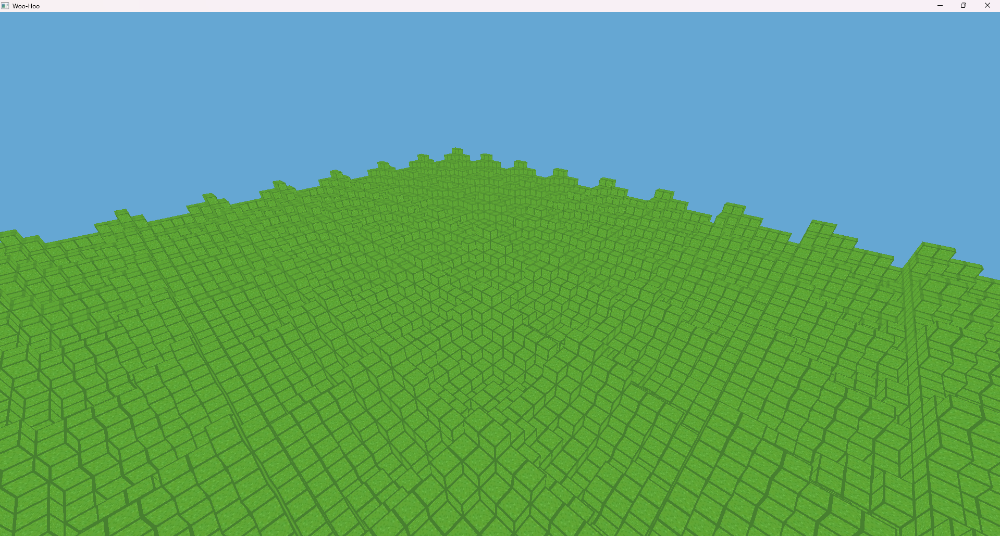

This is how it currently looks

I do the linear transformations of the cpu side and then send it to the gpu. 
It has chunk loading and unloading - I just add and remove chunks from a hashtable, from which chunks are rendered.

It also has face culling, i.e, blocks hidden behind other blocks which wouldn't be visible to the user are not rendered.

Currently, the blocks at the chunk borders are rendered because if I perform a simple check to eliminate them, then there are huge stutters whenever new chunks are loaded/unloaded.

Also, the noise implementation is kinda quacky. It's taken from someplace I cannot remember.
